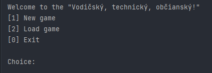
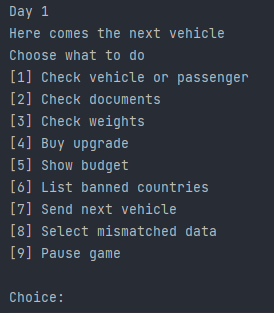
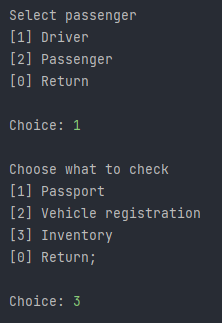
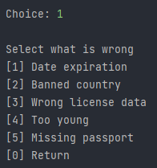
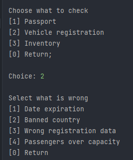
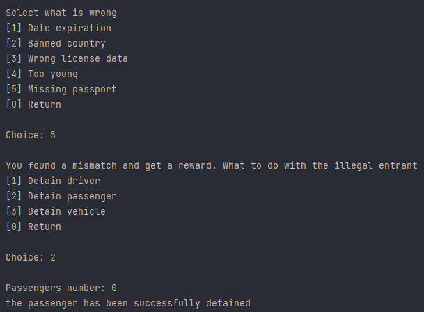

# Princíp hry
Pracujete ako policajt na hraničnej kontrole. Vašou úlohou je kontrolovať doklady a ich správnosť, hľadať kontraband v prechádzajúcich vozidlách a zadržiavať vozidla a ľudí ktorí sa ilegálne pokúsia vstúpiť do krajiny. Za každú nájdenú chybu získavate malú odmenu a na konci dňa získate peniaze za všetky zadržane osoby, vozidla a predmety. Za tieto peniaze si môžete kúpiť novú budovu a následne ju vylepšovať spolu s existujúcimi budovami.

## Ako hrať
Hra prebieha v príkazovom riadku a je ovládaná číslami na klávesnici. Ak je to možné, vždy sa da vrátiť do predošlého menu stlačením 0 (nula) alebo zastaviť hru v hlavnom menu.

Po spustení máte možnosť vytvoriť novú hru alebo načítať existujúcu.

---

Po vytvorení novej hry alebo úspešnom načítaní sa vám napíše číslo dňa (hra sa 5 dní) a ukáže sa vám hlavné herné menu

---

- [1]	Zobrazí menu na získanie popisu vozidla, pasažierov a vodiča
- [2]	Zobrazí menu na kontrolu dokumentov
- [3]	Zobrazí menu na odváženie vodiča alebo pasažiera
- [4]	Zobrazí menu na nákup vylepšení
- [5]	Zobrazí momentálny rozpočet
- [6]	Vypíše krajiny ktoré majú zakázaný vstup
- [7]	Pošle sa ďalšie vozidlo
- [8]	Zobrazí sa menu na výber chýb a porušení
- [9]	Zastaví sa hra a zobrazí sa menu na uloženie hry, pokračovanie a vypnutie programu

---
Menu na výber chýb

---

Možné chyby pri pase

---

Možné chyby pri technickom preukaze

---

Úspešne zadržanie pasažiera.

 ---
